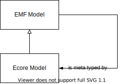

# polyglot-emf

> Making the *Eclipse Modeling Framework* (**EMF**) polyglot.

## Overview

The [Eclipse Modeling Framework](https://www.eclipse.org/modeling/emf/) (although it'd be equally valid to call it the "[Ed Merks](https://ed-merks.blogspot.com/) Framework") is an Eclipse project written in Java that provides lower-level capabilities and facilities that help with implementing modeling languages, environments, and tools.

EMF's main capabilities/facilities are:

1. _A runtime for the JVM to manage models in-memory_.
	Objects in any EMF model (or more accurately: an EMF Resource, an instance of `EResource`) are instantiations of `EObject`s, meta typed as instantiations of `EClass`es.
	The runtime includes a "Command" sub system to manipulate EMF models using "deltas" (∂s).

2. _A serialization to, and deserialization from [XML Metadata Interchange](https://en.wikipedia.org/wiki/XML_Metadata_Interchange) (**XMI**)_.

3. _A meta meta model, called **Ecore**_.
	Ecore is described by Ed Merks as "[...] the de facto reference implementation of [OMG](https://en.wikipedia.org/wiki/Object_Management_Group)'s [https://en.wikipedia.org/wiki/Meta-Object_Facility](EMOF) (Essential Meta-Object Facility)".
	Basically, Ecore is precisely enough to meta model "anything".

4. _A generator from Ecore to Java classes sub typing `EObject`_.

Some features are:

* A Ecore model (which specifies a meta model) is itself an EMF model, so items 3 and 4 re-use items 1 and 2.
	

* An EMF model can be either "dynamic" (using `DynamicEObjectImpl`) or "static" (meaning that each concept/`EClass` is reified through an implementing sub type of `EObject`).

## Motivation

EMF is a JVM-only framework.
This is a pity because EMF works extremely well (as proven by it being used as "middleware" in numerous modeling tools and environments), and is the _only_ reference implementation of EMOF that I know of.

This Git repository is intended to collaborate on proposals to make EMF polyglot.
It'd be very useful to be able to use capabilities/facilities from the list above in, and across various languages.

(added by Federico Tomassetti, with some modification:)
This could open the possibility to create an ecosystem richer than the EMF ecosystem, with a variety of interoperable tools so that, based on common model and meta model formats, we could:

* Have systems for storage and collaboration (Modelix)
* Have systems for parsing, based on ANTLR (a subset of the features of Xtext, maybe something similar to textX)
* Perhaps a way to interact with textual editors involving the Language Server Protocol
* A way to plug-in web editors like WebEditKit and ProjectIt
* Interaction with MPS in various forms
* Work with multiple code generators supporting this format
* Have the possibility of building different stages of these systems in different languages such as Kotlin, Java, Python, TypeScript, Javascript, C#

Ports of (parts of) EMF to JavaScript and Python are available, but:

* It's unclear to _which_ extent they are true ports because of a lack of a specification for EMF other than its implementation and the documentation for that.
* EMF has an internal test suite, but this is coupled to Java/the JVM pretty tightly.

## Links

For the EMF project itself:

* [Entrypoint for the EMF project](https://www.eclipse.org/modeling/emf/).
* [Entrypoint for the official high-level documentation](https://www.eclipse.org/modeling/emf/docs/).
* [Git repository](https://github.com/eclipse/emf).
* [Wikipedia entry](https://en.wikipedia.org/wiki/Eclipse_Modeling_Framework).
* [*EMF: Eclipse Modeling Framework, 2nd Edition*](https://www.informit.com/store/emf-eclipse-modeling-framework-9780321331885) is the "official" book on EMF.
	Both 1st and 2nd editions are no longer in print, but can be bought second-hand, and the 2nd edition as an eBook.
	It's from 2008, so probably not entirely up-to-date anymore.
	(I still have to buy and read it myself.)

For relevant OMG standards:

* [EMOF = Essential Meta-Object Facility - see chapter 12](https://www.omg.org/spec/MOF/2.4.1/PDF).
* [XMI = XML Metadata Interchange](https://www.omg.org/spec/XMI).

For re-implementations or "inspired by" implementations in other languages:

* [ecore.js](https://emfjson.github.io/projects/ecorejs/latest/) (JavaScript).
* [PyEcore](https://github.com/pyecore/pyecore) (Python), and its [documentation](https://pyecore.readthedocs.io/en/latest/).
* [JSOI](https://bitbucket.org/kinoritech/jsoi/src/master/) (JVM (mostly)).
	This project is interesting because (as I understood it from Horacio) it provides an alternative serialization for EMF Resources (models) to JSON that's type-based, rather than containment-based.
	The serialized `EObject`s are organized by type, as lists, instead of as a tree (or trees) by containment.

Specifically about Ecore:

* [JavaDoc of Ecore, with diagrams](http://download.eclipse.org/modeling/emf/emf/javadoc/2.10.0/org/eclipse/emf/ecore/package-summary.html)
* [Ecore as Ecore in XMI](https://github.com/eclipse/emf/blob/master/plugins/org.eclipse.emf.ecore/model/Ecore.ecore)
* [XSD schema for Ecore XMI files](https://github.com/eclipse/emf/blob/master/plugins/org.eclipse.emf.ecore/model/Ecore.xsd)

Specifically on XMI:

* 	Two sources for an XML Schema for the XMI format: [OMG](https://www.omg.org/spec/XMI/20131001/XMI.xsd), [EMF Github repo](https://github.com/eclipse/emf/blob/master/plugins/org.eclipse.emf.ecore/model/XMI.xsd).
	These don't match exactly: how do they differ effectively?

Various:

* [Thread on the _Strumenta Community_ that spawned this](https://d.strumenta.community/t/polyglot-modeling-metamodeling-formats-and-frameworks/1071).
* ["EMF.cloud"](https://www.eclipse.org/emfcloud/) is the umbrella project for components and technologies making the Eclipse Modeling Framework (EMF) and its benefits available in the web and cloud.
	It uses [`emfjson-jackson`](https://github.com/emfjson/emfjson-jackson), a Maven module that implements (de-)serialization of EMF Resources (from and) to JSON.
	The JSON format is [described here](https://emfjson.github.io/about/#json-format).
* [MPS Interoperability](https://github.com/strumenta/mpsinterop) is a project by Strumenta (Federico Tomassetti) to access MPS models from outside MPS.
	Exporting MPS models to EMF should improve interop even more.

## Use cases

Contributed by Federico Tomassetti:

### Parsing and processing (short term)

In the very short term, I see the need we have to combine a parser written in Kotlin with a processing stage written in Python.
The parser is written using ANTLR and then we translate the parse tree to an AST implemented using Kotlin data classes and the [Kolasu framework](https://github.com/Strumenta/kolasu).
To use the parser from a Python program we are just thinking of invoking the parser, make it output JSON and load such JSON from Python.

Now, we can derive the meta model of our AST by examining the Kotlin data classes through reflection or parsing Kotlin code.
Once we get this model we could serialize it in XMI or in a transposition of XMI to JSON.
We could then load such a meta model in Python and generate classes.
We could potentially do that using PyEcore, if I understood correctly.
Ideally, we could also evolve PyEcore to use Python data classes, but this is not strictly necessary.
To enable this scenario we would just need to have a mechanism that from our Kotlin data classes generate the meta model on XMI or JSON-XMI.

Then we would need to translate also the actual AST instances (the model).
At the moment we are serializing JSON and unserializing the JSON on the Python side.
This JSON could be based on JSON-XMI instead of our own format.

### Accessing Modelix from different languages (medium term)

We have APIs to work with Modelix from Kotlin (and Java).
However, it makes sense to work with models stored in Modelix from all sort of other languages, in particular from TypeScript.
At the moment we can work with Modelix only using dynamic API.
For example, if we have a concept Car we do not have a class Car, we just use the class Node and set properties specifying the name (e.g., “plate” or “year” or “color”).
We do not have a class with methods such as “getPlate” or “setColor”.

It could be useful to generate those classes.
If we were exposing the meta model in some common format, like XMI, we may be able to reuse existing code generators, and then combine them with a runtime that's “Modelix-aware”.

## Proposals

Some proposals for separate work packages:

1. Describe a [JSON Schema](https://json-schema.org/specification.html) for "XMI in JSON", based on/extracted from [ecore.js](https://emfjson.github.io/projects/ecorejs/latest/), [`emfjson-jackson`](https://github.com/emfjson/emfjson-jackson) and [PyEcore](https://github.com/pyecore/pyecore).
	This would be useful as JSON Schema is a standard that's increasingly supported by tools, and standards/frameworks/specifications such as [OpenAPI](http://spec.openapis.org/oas/v3.0.3) (formerly Swagger).
	* If ecore.js, `emfjson-jackson` and PyEcore differ: find a middle ground, and try to advocate/establish that through PRs?

